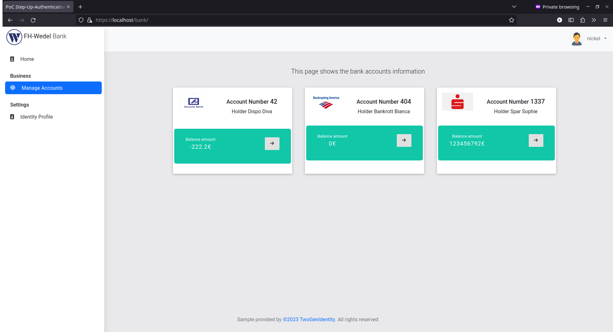

# PoC Step-up Authentication mit OAuth

### DISCLAIMER
    Dieses Repository dient ausschließlich zu Demonstrationszwecken, daher wird dringend davon abgeraten diese Konfiguration für jegliche Art von Produktivumgebungen zu verwenden!

---
Dieses Repository demonstriert die Implementierung einer erweiterten Authentifizierungsmethode unter Verwendung von OAuth. Durch die Step-up-Authentifizierung in diesem PoC wird eine zusätzliche Sicherheitsebene für den Zugriff auf bestimmte geschützte Ressourcen implementiert, die bei Bedarf eine zusätzliche Authentifizierung erfordert.

## Architektur

- Zur einfachen Einrichtung und Nutzung wird ein **Docker Compose Stack** verwendet, der eine Webanwendung und die notwendigen Dienste bereitstellt, um die Step-up-Authentifizierung in der Praxis zu demonstrieren. 

- [Keycloak](https://www.keycloak.org/) wird für die **Standard OpenID Connect Authentifizierung** verwendet und dient als Identity Provider, der die Authentifizierung und Autorisierung der Benutzer für die eigentliche Anwendung verwaltet. Keycloak ist eine Open Source Software, die eine umfassende Lösung für Identity und Access Management (IAM) bietet. Entwickelt von Red Hat, ermöglicht Keycloak die Verwaltung von Benutzern, Authentifizierung, Autorisierung und SSO (Single Sign-On) für Anwendungen und Dienste.

- Das PoC demonstriert die Implementierung der **OAuth 2.0 Step-up Authentication** basierend auf dem [OAuth 2.0 Step-up Authentication Challenge Protocol](https://datatracker.ietf.org/doc/draft-ietf-oauth-step-up-authn-challenge/). Dies ermöglicht es der API, eine Step-up-Authentifizierung zu implementieren, indem der erforderliche Authentication Context Level (acr) erkannt wird. Wenn dieser Level nicht ausreichend ist, wird der Client angewiesen, eine Step-up-Authentifizierung auszulösen.

- Die **Bank Account API** ist der [OAuth2 Resource Server](https://docs.spring.io/spring-security/site/docs/current/reference/html5/#oauth2resourceserver) und wird mittels [Spring Boot](https://spring.io/projects/spring-boot) realisiert. Spring Boot ist ein Open-Source-Framework zur schnellen und einfachen Entwicklung von Java-Anwendungen. Die API implementiert das [OAuth 2.0 Step-up Authentication Challenge Protocol](https://datatracker.ietf.org/doc/draft-ietf-oauth-step-up-authn-challenge/) und ermöglicht in diesem Beispiel die Integration des OAuth2 Authentifizierungs- und Autorisierungsmechanismus in die eigentliche Anwendung, um eine sichere Zugriffskontrolle auf Ressourcen zu gewährleisten. Die API löst die eigentliche Step-up-Authentifizierung aus, sobald ein ihr präsentierter Access Token aufgrund des arc-Claim eine unzureichende Authentifizierung aufweist.

- Das **FH-Wedel Bank Portal** ist eine Single-Page-Anwendung, die mit Keycloak integriert ist und den Fehlertyp *401 Unauthorized* mit dem *WWW-Authenticate-Header* unterstützt. Dadurch kann eine Step-up-Authentifizierung erfolgreich durchgeführt werden.


# Installation
## Vorraussetzungen

 * Folgende Pakete müssen bereits auf dem zu verwendetn System installiert sein: Git, [Docker](https://www.docker.com/get-docker) und [Docker Compose](https://docs.docker.com/compose/install/#install-compose)<br>

## Download und Setup

1. Clonen des Repositories
    ````bash
    git clone 
    ````

2. Um den den Docker-Compose-Stack zu starten, folgenden Befehl ausführen

   ```sh
   docker-compose -f docker-compose-idp.yml -f docker-compose-apps.yml -f docker-compose-lb.yml up
   ```

3. Die Anwendungen werden durch einen NGINX Webserver unter den folgenden URLs bereitsgestellt

| Anwendung                 | URI                        | Username | Password  | Authn or uthz reference|
| ------------------------- | -------------------------- | -------- | --------- | --------- |
| FH-Wedel Bank Portal        | https://localhost/bank     |          |           | pwd (1F) or pwd + passkeys (MFA) |
| Bank Account API Portal   | https://localhost/api      |          |           | OAuth 2.0 ACR claim loa2  |
| Keycloak Console          | https://localhost          | admin    | password  |


# Ablauf

Anforderungen für das FH-Wedel Banking-Portal:

- **Unterstützung OIDC-Login**: Das Portal unterstützt die Anmeldung über OpenID Connect (OIDC) mit einem Faktor, bestehend aus Benutzername und Passwort, sowie mit zwei Faktoren unter Verwendung von Passkeys.

- **Zugriffskontrolle für Bankkonten**: Nur authentifizierte Benutzer, die eine Zwei-Faktor-Authentifizierung (Passkeys) durchgeführt haben, erhalten Zugriff auf die Funktion zur Verwaltung der Bankkonten. Dies gewährleistet eine zusätzliche Sicherheitsebene für den Zugriff auf sensible Informationen.

- Auslösen der **Step-up Authentication**: Wenn ein Benutzer nicht mit Zwei-Faktor-Authentifizierung (Passkeys) authentifiziert ist und dennoch versucht, Bankkonten zu verwalten, wird automatisch die Schritt-für-Schritt-Authentifizierung ausgelöst. Dies bedeutet, dass der Benutzer aufgefordert wird, zusätzliche Authentifizierungsschritte durchzuführen, um seine Identität sicher zu bestätigen, bevor der Zugriff gewährt wird.

Diese Implementierung des Prozesses gewährleistet nicht nur die Sicherheit der Bankkontenverwaltung, sondern bietet auch ein hohes Maß an Benutzerfreundlichkeit, da die Step-up-Authentifizierung nur dann ausgelöst wird, wenn sie erforderlich ist.

# Screenshots

### Home


### Keycloak Self-Registration


### Keycloak Login


### Access Token nach Login mit Username und Passwort


### Step-up-Authentifizierung


### Access Token nach erfolgreicher Step-up-Authentifizierung


### Account Übersicht nach erfolgreicher Step-up-Authentifizierung


<br>

# Credits
Dieses PoC basiert auf dem Artikel von Martin Besozzi [Keycloak Workshop for Step Up with MFA Biometrics Authentication (Passkeys) and Passwordless experience with Passkey autofill](https://embesozzi.medium.com/keycloak-workshop-for-step-up-with-mfa-biometrics-authentication-passkeys-b7020ea9ae1b) sowie dem dazugehörigen [GitHub Respository](https://github.com/embesozzi/keycloak-workshop-stepup-mfa-biometrics).
